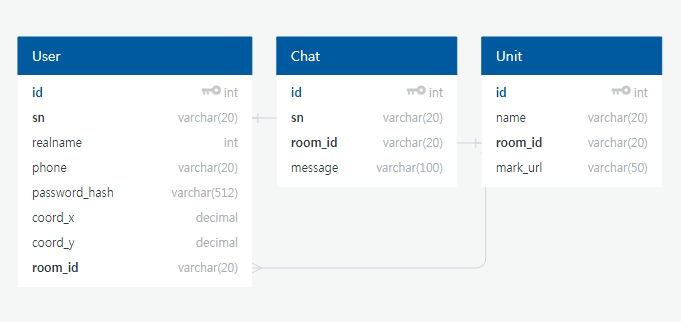

## 다모아(Damoa)웹 서버

### 1. 기술 및 구현

#### 참조한 오픈소스 라이브러리
| 라이브러리 | 사용 용도 |
|---|:---:|
| `express` | http 요청 처리 |
| `sequelize` | 데이터베이스 ORM | 
| `socket.io` | 웹소켓 통신 (채팅 기능) |

#### API 구성
| 역할 | 주소 | 메서드 | 파라메터 |
|---|:-----|:----:|:-------|
| 회원가입 | `/users/join` | POST | sn: 군번, realname: 실명, phone: 전화번호, password: 비밀번호 |
| 로그인 | `/users/login` | POST | sn: 군번(1x-xxxxxx), password: 비밀번호 |
| 로그아웃 | `/users/logout` | POST | 불필요 |
| 부대 전체 조회 | `/rooms` | GET | 불필요 |
| 부대 검색 | `/rooms/search` | POST | keyword: 검색할 지역 또는 부대 통상명칭 |
| 부대 채팅방 접속 | `/rooms/join` | POST | room_id: 접속할 부대 고유번호
| 위치 업데이트 | `/users/update_geo` | POST | coord_x: lat 좌표, coord_y: lng 좌표 |
| 전위 위치 확인 | `/users/retrive_geo` | POST | 불필요 (방번호 세션사용) |

#### 데이터베이스 스키마 구성

### 2. 서버 초기 설정

서버를 운영하기 위해서 다음과 같은 초기 설정이 필요합니다.

**1. 필수 패키지 설치**
> npm install --save

> npm install -g nodemon mocha 

**2. DB 접속 환경설정**
> sequelize init --config configs/sequelize.json

> 생성되는 sequelize 구성 폴더에서 configs/sequelize.json 파일의 데이터베이스 접속 정보 수정

**3. DB 스키마(테이블) 구축 및 테스트 데이터 입력**
>  mocha test/seq_dump.js 

> 데이터베이스 스키마 생성 및 테스트용 부대 정보, 사용자 계정 생성

**4. 포트설정 및 서버 시작**
> export PORT=xxxx (원하는 포트 입력)

> ./start_node.sh 

**5. 추가 설정**

> 서버 환경에 따른 reverse proxy 와 연동하여 운영 (nginx 이용하여 SSL 기능 적용 권장)