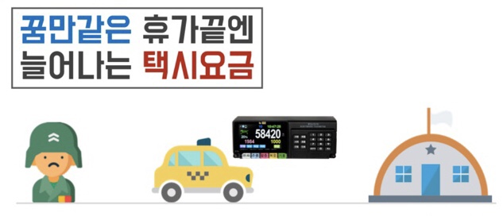

# 다모아(Damoa)
---
  

**출타 장병들을 위한 택시 / 대중교통 합승 플랫폼**

[앱 설치 파일(APK) 다운로드](http://download.live2skull.net/damoa.apk)  
[발표 자료 다운로드](http://download.live2skull.net/presentation.zip)  

### 시연
 - 왼쪽부터 첫번째(김병장), 두번째(전상병), 세번째(양일병)이 있다. 김병장은 현재 금정에서 과천으로 가고  있으며 과천의 한 부대로 택시를 타고 가기 위해 합승자를 모집한다.
 - 과천 인근 PC방에 있던 전상병이 부대에 복귀하기 위해 앱을 실행하여 김병장과 같이 가기로 약속을 한다.
 - 약속시간이 다가올 때 즈음 양일병이 부대복귀를 희망하여 앱을 실행하여 김병장과 전상병과 만나고, 셋이서 택시를 타고 부대를 가서 택시비의 부담이 덜어진다.
[시연 영상 바로가기](https://youtu.be/p-DyMTscsSk)  

### 일반 현황
 - 인원 : 국군지휘통신사령부 육군상병 박지호(안드로이드 앱), 15보병사단 육군일병 양해찬(API 서버)
 - 개발 기간 : '18.10.22 ~ '18.10.25

### 개발 배경

  
하루에도 수만여명의 장병들이 휴가에 복귀하기 위해 택시를 이용하여 이동하게 되는데, 병사들에게 왕복 교통비는 출타 간에 큰 부담 중 하나이다.

이에 목적지가 같은 주변의 전우들에게 신속하게 연락하여 교통비와 출타시간 절약 및 전우들과의 훈훈한 분위기를 느낄 수 있는 주변 전우들 다모아(Damoa) 애플리케이션을 개발하였다.  

### 서비스 구성도
  

### 사용 시나리오

부대에서 출발 또는 부대로 복귀를 희망하는 장병이 애플리케이션을 실행한다.

본인 계정으로 로그인하여 접속한다.

자신의 소속 부대(출발 또는 도착)을 검색 후 해당 부대 채팅방으로 접속한다.

채팅방에서 전우들과의 이동 일정을 조율하고, 택시에 동승한다.

### 기대효과

 - 출타 장병들의 택시비 부담을 덜어줌으로써 부대 복지가 향상된다.
 - 출타 복귀 시간대에 택시 한대로 여러 병사가 이용함으로 택시 부족으로 인한 지연복귀를 예방할 수 있다.

### 향후 추진 계획

 - 인터넷망에 군 조직도를 둘 수는 없으므로 보안적인 측면을 고려해서 기능 개선이 필요하다.
 - 채팅방에서의 푸시 알림 추가 기능이 필요하다.
 - 부대 조직을 관리할 수 있는 관리자 페이지가 필요하다.
 - 각군 인사행정 서비스, 핀테크 또는 운송 서비스와 융합.

### 설치 환경
 - Android API 26(Android 8.0) 이상의 버전이 필요합니다.
 - 네트워크 접속이 필요합니다.
 - 위치정보 공유를 위해 GPS연결이 필요합니다.

### 서버 기술 문서 [링크](/damoa-server/readme.md)

---

### 페이지 구성

#### 1. 로그인 

본인의 군번과 비밀번호를 이용하여 로그인한다. 기존의 회원이 아니라면, 회원가입을 진행한다.

#### 2. 회원가입 

군번, 이름, 전화번호로 회원가입이 가능하다. 전화번호는 승인 시 타인에게 보여줄 수 있어 빠른 연락이 필요할 때 사용할 수 있다.

#### 3. 부대검색 

자신이 소속된 부대(출발 또는 도착지)를 검색한다.

#### 4. 채팅방 

같은 소속의 부대원들과 연락하여 동일한 목적지로 가는 전우들과 일정을 조율한다.

#### 5. 위치 공유방

같은 채팅방에 접속한 국군장병들의 위치를 공유하여 시간 또는 장소를 쉽게 선정할 수 있다.

